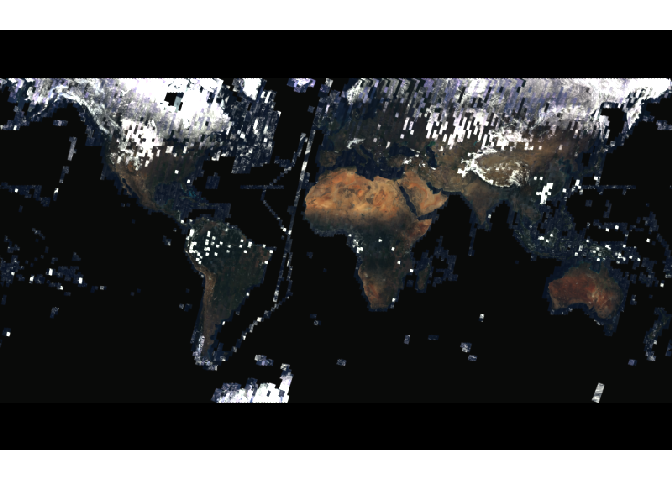

<!-- README.md is generated from README.Rmd. Please edit that file -->

# aarapir

Access ArcGIS online API enpoints with R

<!-- badges: start -->

[](https://www.repostatus.org/#concept)
[](https://cran.r-project.org/package=aarapir)
<!-- badges: end -->

aarapir provides an R interface for querying and downloading publically
accessible ArcGIS Online feature layers. The primary goal is to provide
R users with an easy way to download features from ArcMap Online. I
don’t not anticipate this to be a full-fledged API to ArcGIS Online
and Enterprise. See the [ArcGIS Python
API](https://github.com/Esri/arcgis-python-api) for a more robust access
to the ArcGIS API. This is super experimental and likely to change. This
project is not associated with or supported by ESRI.

## Features

  - [x] Return mapservice information

  - [x] Return feature layer information

  - [x] Return full feature layers (will loop requests if the maximum
    number of records is limited)

  - [ ] Pass user query so only needed records are returned

  - [ ] Return image service information

  - [x] Provide interface for image or tile data

## Example

Download a point feature layer:

``` r
library(aarapir)
## Start with a mapserver url, these typically end in "/MapServer"
## Some examples here: https://sampleserver6.arcgisonline.com/arcgis/rest/services

url <- "https://sampleserver6.arcgisonline.com/arcgis/rest/services/WindTurbines/MapServer"

## This returns a list with information from the Map Service
webserver <- service_info(url)
#> https://sampleserver6.arcgisonline.com/arcgis/rest/services/WindTurbines/MapServer?f=pjson

## We can see what feature layers are available to download
webserver$layers
#>   id               name parentLayerId defaultVisibility subLayerIds minScale
#> 1  0 TurbineInspections            -1              TRUE          NA        0
#>   maxScale          type      geometryType
#> 1        0 Feature Layer esriGeometryPoint

## This returns a list with information about the feature layer
## id 0
layerinfo <- layer_info(webserver, 0)
#> https://sampleserver6.arcgisonline.com/arcgis/rest/services/WindTurbines/MapServer/0?f=pjson

## This downloads the entire feature layer and reads it into a
## simple feature dataframe
dat <- layer_download(layerinfo)
#> https://sampleserver6.arcgisonline.com/arcgis/rest/services/WindTurbines/MapServer/0/query?where=1%3D1&outFields=objectid%2Cstatus%2Cdateinspected%2Cnotes%2Cshape%2Cphoto%2Cglobalid&returnCountOnly=true&f=json
#> Number of target records:  11
#> https://sampleserver6.arcgisonline.com/arcgis/rest/services/WindTurbines/MapServer/0/query?where=1%3D1&outFields=objectid%2Cstatus%2Cdateinspected%2Cnotes%2Cshape%2Cphoto%2Cglobalid&returnGeometry=true&f=geojson
#> Reading layer `OGRGeoJSON' from data source `{"type":"FeatureCollection","crs":{"type":"name","properties":{"name":"EPSG:4326"}},"features":[{"type":"Feature","id":2,"geometry":{"type":"Point","coordinates":[-116.61549461097971,33.860188265218177]},"properties":{"objectid":2,"status":null,"dateinspected":1295450555000,"notes":"test","photo":null,"globalid":"{E41FAF3C-BB03-445F-8E6A-12227C7EC007}"}},{"type":"Feature","id":6,"geometry":{"type":"Point","coordinates":[-116.53298407724887,33.850347840635195]},"properties":{"objectid":6,"status":1,"dateinspected":-2209161600000,"notes":"","photo":null,"globalid":"{DF9403DA-C08D-4C5C-A505-77A761F296D9}"}},{"type":"Feature","id":12,"geometry":{"type":"Point","coordinates":[-116.61729294744869,33.918809741984433]},"properties":{"objectid":12,"status":null,"dateinspected":null,"notes":null,"photo":null,"globalid":"{3EA788B3-32D8-4B1D-8CBC-D1E5757A50DC}"}},{"type":"Feature","id":13,"geometry":{"type":"Point","coordinates":[-116.66706626262032,33.871138708125052]},"properties":{"objectid":13,"status":null,"dateinspected":null,"notes":null,"photo":null,"globalid":"{FB929FD4-D75D-419D-B5B9-BDF371F0C34A}"}},{"type":"Feature","id":14,"geometry":{"type":"Point","coordinates":[-116.6811048904371,33.918809741984433]},"properties":{"objectid":14,"status":null,"dateinspected":null,"notes":null,"photo":null,"globalid":"{736F24BE-0A10-4779-BD66-71643191087B}"}},{"type":"Feature","id":17,"geometry":{"type":"Point","coordinates":[-116.59929055194976,33.917358425474795]},"properties":{"objectid":17,"status":null,"dateinspected":null,"notes":"","photo":null,"globalid":"{9C4CE3DB-9B5F-4BE6-84E8-3949DF5DA6A4}"}},{"type":"Feature","id":18,"geometry":{"type":"Point","coordinates":[-116.55009795898171,33.913015533223799]},"properties":{"objectid":18,"status":null,"dateinspected":null,"notes":"","photo":null,"globalid":"{CEE9E968-58A5-41D2-BF28-6B14E3997352}"}},{"type":"Feature","id":19,"geometry":{"type":"Point","coordinates":[-116.54067810004665,33.887822397437517]},"properties":{"objectid":19,"status":null,"dateinspected":null,"notes":"","photo":null,"globalid":"{897F8DEF-8C3B-4CB2-88DE-8EA1EF9CD01D}"}},{"type":"Feature","id":20,"geometry":{"type":"Point","coordinates":[-116.57731088259835,33.85306103187407]},"properties":{"objectid":20,"status":null,"dateinspected":null,"notes":"","photo":null,"globalid":"{D4F83D52-C26B-4BEF-A215-D4793B680476}"}},{"type":"Feature","id":21,"geometry":{"type":"Point","coordinates":[-116.58463743874938,33.88956009338046]},"properties":{"objectid":21,"status":null,"dateinspected":null,"notes":"","photo":null,"globalid":"{4FAEBC0C-5060-49D5-B284-54B2F58C2A14}"}},{"type":"Feature","id":22,"geometry":{"type":"Point","coordinates":[-116.64952979541147,33.893904180600316]},"properties":{"objectid":22,"status":null,"dateinspected":null,"notes":"","photo":null,"globalid":"{E0B5746C-2AFA-4D26-B8F9-156C32DCCA8E}"}}]}' using driver `GeoJSON'
#> Simple feature collection with 11 features and 6 fields
#> geometry type:  POINT
#> dimension:      XY
#> bbox:           xmin: -116.6811 ymin: 33.85035 xmax: -116.533 ymax: 33.91881
#> epsg (SRID):    4326
#> proj4string:    +proj=longlat +datum=WGS84 +no_defs
dat
#> Simple feature collection with 11 features and 6 fields
#> geometry type:  POINT
#> dimension:      XY
#> bbox:           xmin: -116.6811 ymin: 33.85035 xmax: -116.533 ymax: 33.91881
#> epsg (SRID):    4326
#> proj4string:    +proj=longlat +datum=WGS84 +no_defs
#> First 10 features:
#>    objectid status dateinspected notes photo
#> 1         2     NA  1.295451e+12  test  <NA>
#> 2         6      1 -2.209162e+12        <NA>
#> 3        12     NA            NA  <NA>  <NA>
#> 4        13     NA            NA  <NA>  <NA>
#> 5        14     NA            NA  <NA>  <NA>
#> 6        17     NA            NA        <NA>
#> 7        18     NA            NA        <NA>
#> 8        19     NA            NA        <NA>
#> 9        20     NA            NA        <NA>
#> 10       21     NA            NA        <NA>
#>                                  globalid                   geometry
#> 1  {E41FAF3C-BB03-445F-8E6A-12227C7EC007} POINT (-116.6155 33.86019)
#> 2  {DF9403DA-C08D-4C5C-A505-77A761F296D9}  POINT (-116.533 33.85035)
#> 3  {3EA788B3-32D8-4B1D-8CBC-D1E5757A50DC} POINT (-116.6173 33.91881)
#> 4  {FB929FD4-D75D-419D-B5B9-BDF371F0C34A} POINT (-116.6671 33.87114)
#> 5  {736F24BE-0A10-4779-BD66-71643191087B} POINT (-116.6811 33.91881)
#> 6  {9C4CE3DB-9B5F-4BE6-84E8-3949DF5DA6A4} POINT (-116.5993 33.91736)
#> 7  {CEE9E968-58A5-41D2-BF28-6B14E3997352} POINT (-116.5501 33.91302)
#> 8  {897F8DEF-8C3B-4CB2-88DE-8EA1EF9CD01D} POINT (-116.5407 33.88782)
#> 9  {D4F83D52-C26B-4BEF-A215-D4793B680476} POINT (-116.5773 33.85306)
#> 10 {4FAEBC0C-5060-49D5-B284-54B2F58C2A14} POINT (-116.5846 33.88956)
```

Download a raster:

``` r
url <- "https://landsat2.arcgis.com/arcgis/rest/services/Landsat8_Views/ImageServer"
webserver <- service_info(url)
#> https://landsat2.arcgis.com/arcgis/rest/services/Landsat8_Views/ImageServer?f=pjson
r1 <- image_download(webserver,
                     size = "800,500",)
#> https://landsat2.arcgis.com/arcgis/rest/services/Landsat8_Views/ImageServer/exportImage?bbox=-20037507.0672%2C-9694091.0703%2C20037507.8427882%2C9691188.9297&bboxSR=3857&size=800%2C500&format=tiff&f=image
r1
#> class      : RasterBrick 
#> dimensions : 500, 800, 4e+05, 11  (nrow, ncol, ncell, nlayers)
#> resolution : 50093.77, 50093.77  (x, y)
#> extent     : -20037507, 20037508, -12524893, 12521991  (xmin, xmax, ymin, ymax)
#> crs        : +proj=merc +a=6378137 +b=6378137 +lat_ts=0.0 +lon_0=0.0 +x_0=0.0 +y_0=0 +k=1.0 +units=m +nadgrids=@null +no_defs 
#> source     : C:/Users/michael.schramm/AppData/Local/Temp/Rtmpy6fHOd/ras2cd03a1b9e9.tiff 
#> names      : ras2cd03a1b9e9.1, ras2cd03a1b9e9.2, ras2cd03a1b9e9.3, ras2cd03a1b9e9.4, ras2cd03a1b9e9.5, ras2cd03a1b9e9.6, ras2cd03a1b9e9.7, ras2cd03a1b9e9.8, ras2cd03a1b9e9.9, ras2cd03a1b9e9.10, ras2cd03a1b9e9.11 
#> min values :           -32768,           -32768,           -32768,           -32768,           -32768,           -32768,           -32768,           -32768,           -32768,            -32768,            -32768 
#> max values :            32767,            32767,            32767,            32767,            32767,            32767,            32767,            32767,            32767,             32767,             32767
raster::plotRGB(r1, r = 4, g = 3, b = 2, stretch = "lin",
                bgalpha = 0)
```


